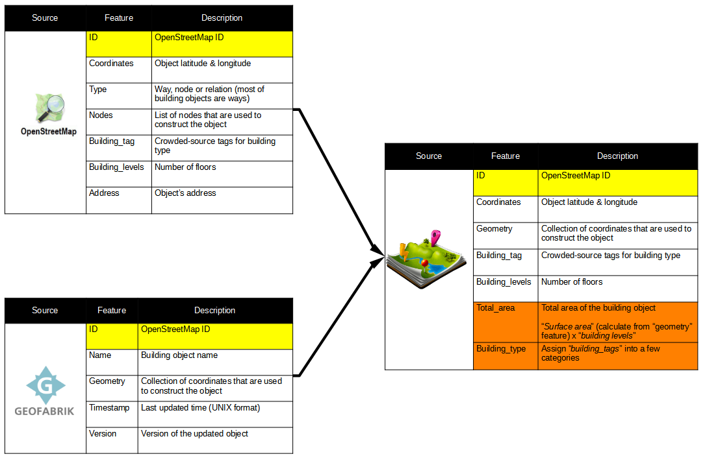

# Data Acquisition
1. Access [Postleitzahl](https://www.suche-postleitzahl.org/) to get list of postal codes in Germany
1. Access Overpass API to get building footprints for all postal codes
1. Access [Regional Statistics](https://www.regionalstatistik.de/) to get demographics data
1. Access [GeoFabrik](https://download.geofabrik.de/europe/germany.html) to download latest updated of OSM data dump
# Data Preprocessing
1. Enhance building objects data by merging Overpass + Geofabrik source
1. Create additional features:
    1. **Total area** = building footprint surface area (calculate using Geometry feature from Geofabrik) * building levels (from Overpass)
    1. **Building type (naive)** = naive classification of building footprints using manual dictionary

   
# Buildings classification
1. Generate additional features for EDA and clustering model:
    1. Turning points (polygon)
    1. Rectangularity = use the ratio of the footprint area to the area of its minimum bounding rectangle (MBR)
         - Rectangularity = surface area / MBR area
         - Larger rectangularity = simpler architecture style
         - Smaller rectangularity = more complex

1. Apply Tobler's geography law into clustering footprints (objects that are closed together --> same functions | near things are more relevant than far things)
    1. Proximity-based grouping footprints into **building blocks** (DBSCAN)
    1. Geography law apply: find footprints with similar shape (turning func, rectangularity) + size (total_area) ==> get majority of types
        1. Same building block
        1. Same area
1. Apply statistical analysis results to categorize left-over footprints